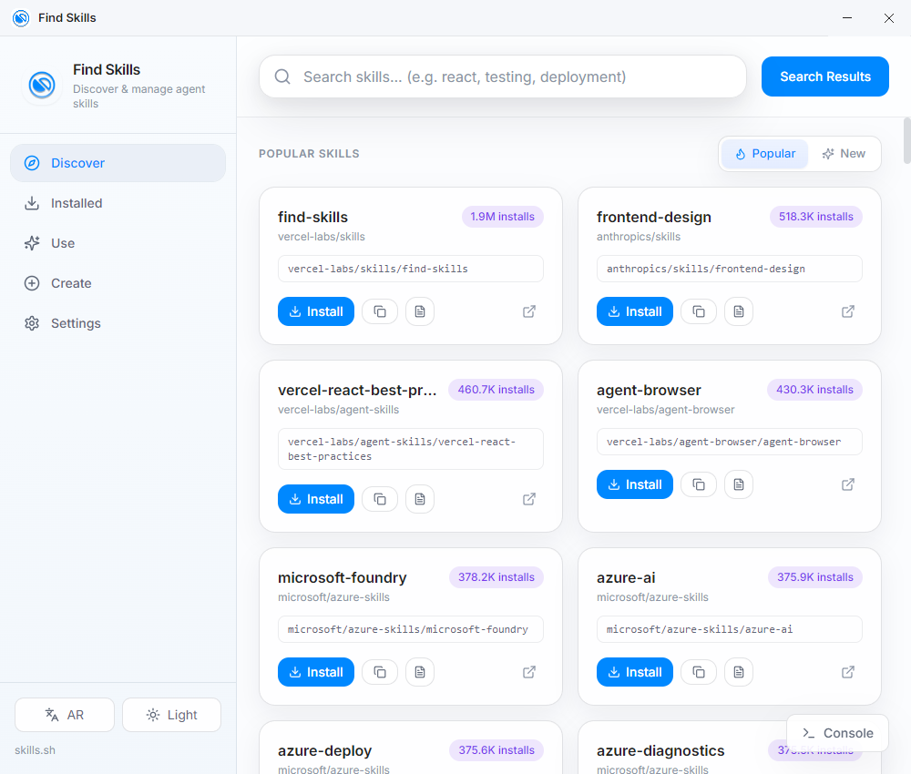
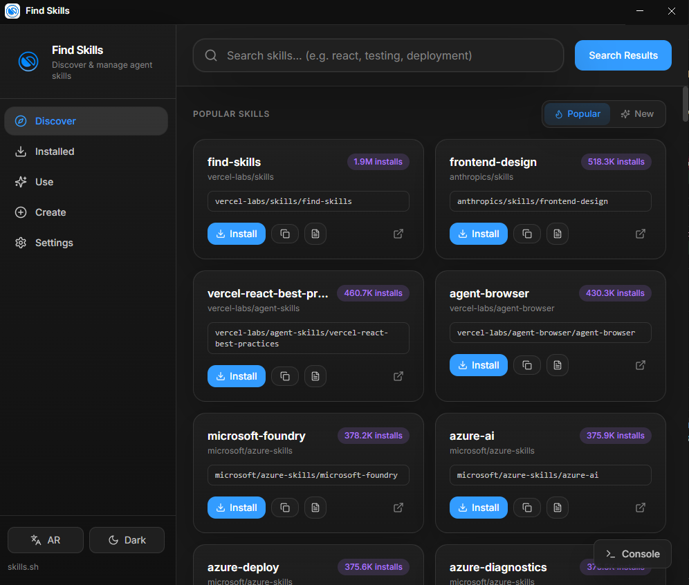

<p align="center">
  
</p>

<h1 align="center">Find Skills</h1>

<p align="center">
  <strong>Desktop GUI for the open agent skills ecosystem</strong>
</p>

<p align="center">
  A graphical alternative to <code>npx skills</code> — search, install, update, and create agent skills without the terminal.
</p>

<p align="center">
  
  
  
  
  
</p>

---

<p align="center">
  
  
</p>

## About

**Find Skills** is a desktop app that wraps the official [`skills`](https://www.npmjs.com/package/skills) CLI with a modern UI. It connects to the [skills.sh](https://skills.sh) registry so you can browse, install, and manage agent skills for tools like Cursor and other AI agents.

Instead of typing commands in the terminal, you can:

- **Discover** popular and new skills, search the registry, and preview `SKILL.md`
- **Install** skills globally or per project (symlink or copy)
- **Manage** installed skills: update, remove, and check for updates
- **Use** a skill to generate a prompt without installing it
- **Create** a new `SKILL.md` template
- Switch between **Arabic (RTL)** and **English**
- Choose **dark, light, or system** theme
- Watch live CLI output in the built-in **console**

## Features

| Section | What you can do |
|--------|------------------|
| **Discover** | Search the registry, browse popular & new skills, preview `SKILL.md` |
| **Installed** | List installed skills, check updates, update all, remove |
| **Use** | Generate a prompt from a skill without installing it |
| **Create** | Scaffold a new `SKILL.md` with `skills init` |
| **Settings** | Theme, language (AR/EN), default project folder, install method, telemetry |

## Requirements

- [Node.js](https://nodejs.org/) 18 or newer
- npm
- Windows or macOS

## Quick start

```bash
git clone https://github.com/albrektv/find-skills.git
cd find-skills
npm install
npm run dev
```

## Scripts

| Command | Description |
|---------|-------------|
| `npm run dev` | Start the app in development mode |
| `npm run build` | Compile main, preload, and renderer |
| `npm run preview` | Preview the production build |
| `npm run build:win` | Build a Windows installer (NSIS) |
| `npm run build:mac` | Build a macOS disk image (DMG) |
| `npm run typecheck` | Run TypeScript checks |

Built installers are written to the `release/` folder.

## How it works

```
┌─────────────┐     IPC      ┌──────────────────┐     fetch      ┌─────────────┐
│   React UI  │ ◄──────────► │  Electron main   │ ─────────────► │  skills.sh  │
│  (renderer) │              │  + skills CLI    │                │     API     │
└─────────────┘              └──────────────────┘                └─────────────┘
```

- **Search & browse** — The main process calls `https://skills.sh/api/search` and the download API for skill details.
- **Install / remove / update** — Runs the real `skills` CLI (`node_modules/skills/bin/cli.mjs`) with non-interactive flags.
- **Security** — Context isolation enabled; Node integration is disabled in the renderer. IPC goes through a typed preload bridge.

## Project structure

```
find-skills/
├── electron/
│   ├── main/          # Main process + registry & CLI services
│   ├── preload/       # Secure IPC bridge
│   └── ipc/           # Channel definitions & handlers
├── src/
│   ├── components/    # Shared UI components
│   ├── pages/         # Lazy-loaded app pages
│   ├── stores/        # Zustand state
│   ├── services/      # IPC client
│   ├── i18n/          # Arabic & English strings
│   └── types/         # Shared TypeScript types
├── Res/               # App icon & logo
└── release/           # Built installers (gitignored)
```

## Tech stack

- [Electron](https://www.electronjs.org/) + [electron-vite](https://electron-vite.org/)
- [React 19](https://react.dev/) + [TypeScript](https://www.typescriptlang.org/)
- [Tailwind CSS](https://tailwindcss.com/) + [Framer Motion](https://www.framer.com/motion/)
- [Zustand](https://zustand.docs.pmnd.rs/) for state
- [skills](https://www.npmjs.com/package/skills) CLI as the backend

## Related links

- Registry: [skills.sh](https://skills.sh)
- npm package: [skills](https://www.npmjs.com/package/skills)

## License

MIT

---

<p align="center">
  Made for the open agent skills ecosystem.
</p>
